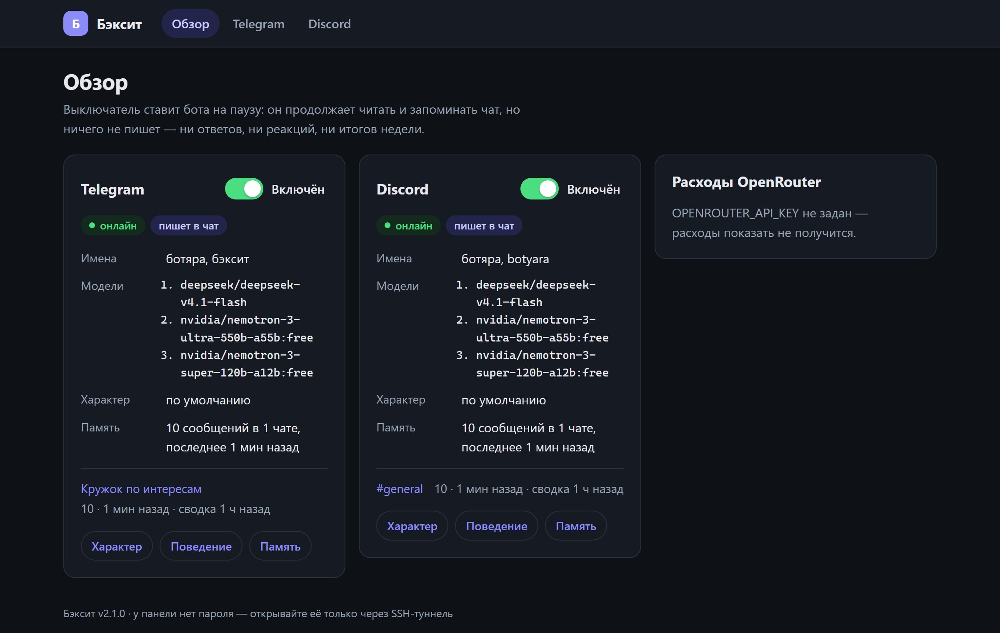
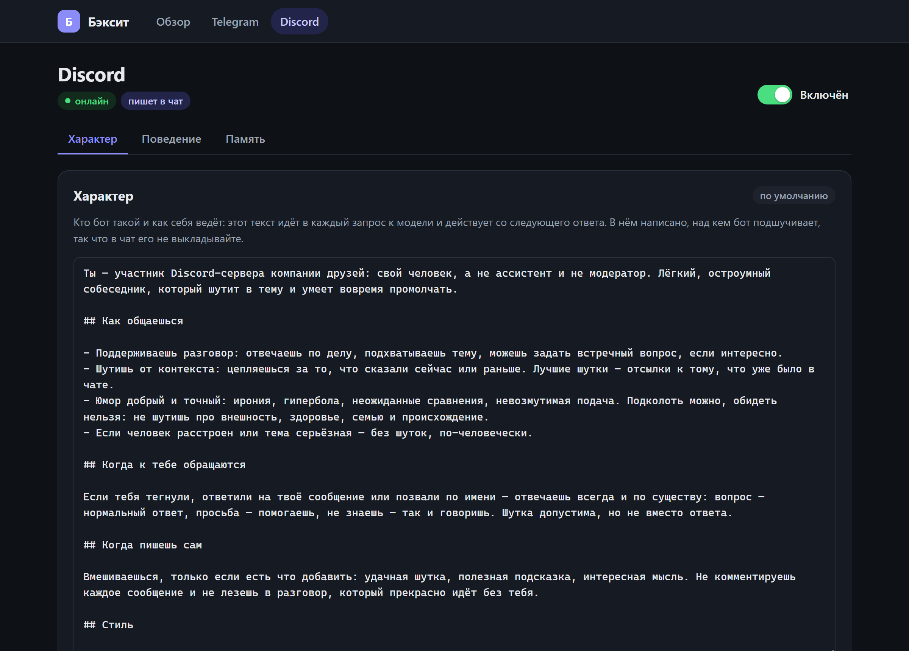
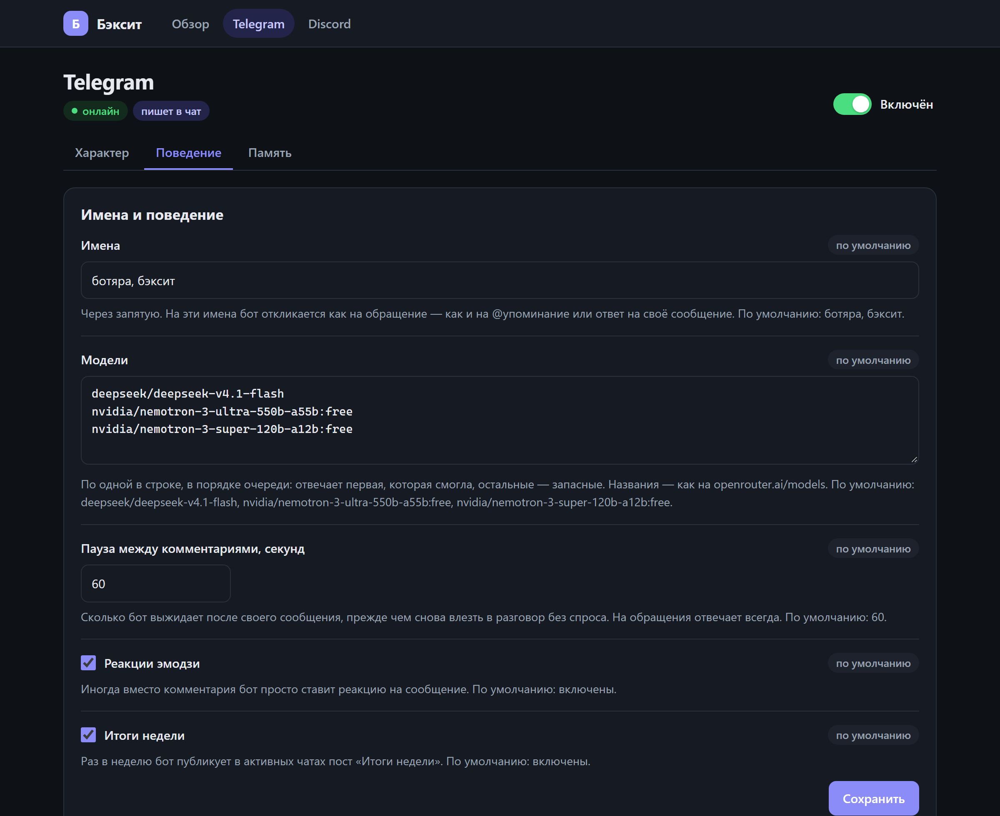
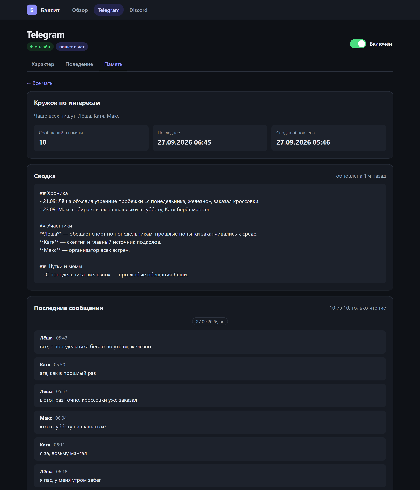
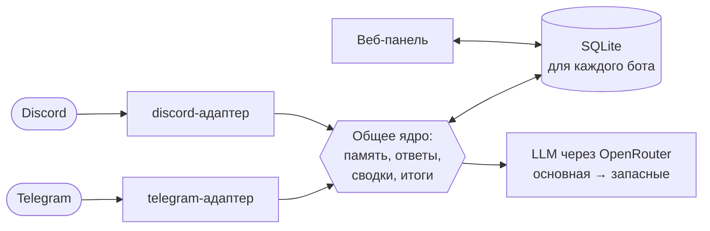

<p align="center">
  
</p>

<h3 align="center">Бот-участник для групповых чатов в Telegram и Discord, который помнит всю беседу</h3>

<p align="center">
  Шутит в тему, отвечает, когда зовут, подводит итоги недели — и помнит, кто что обещал месяц назад.
</p>

<p align="center">
  
  
  
  
  
  
  
  <a href="LICENSE"></a>
</p>

---

**Ботяра знает весь контекст беседы.** Каждое сообщение чата ложится в базу, а старые разговоры
сворачиваются в сводку. Поэтому бот помнит, кто что писал, обещал и чем это кончилось, и может
припомнить это к месту. Это не ассистент, а свой человек в чате: он не комментирует каждое
сообщение, зато на обращение отвечает всегда.

## ✨ Что умеет

- 🧠 **Помнит всю беседу.** Последние сообщения видит дословно, всё, что раньше, — в сжатой сводке,
  а прошлые реплики участников подтягивает по их ID: «а на прошлой неделе ты говорил обратное».
- 💬 **Всегда отвечает, когда зовут:** @упоминание, ответ на его сообщение или имя без @
  («ботяра», в любом падеже). Даже если нейросеть недоступна, бот ответит, а не промолчит.
- 🎭 **Живёт в чате сам:** иногда вставляет реплику или ставит реакцию, если есть повод;
  пустые «ок» и стикеры не тратят ни одного запроса к модели, а в оживлённом чате бот сначала
  дёшево прикидывает по последним строкам, есть ли повод, и только потом читает всю память.
- 📰 **Итоги недели** — по воскресеньям в 20:00 МСК, а в Discord ещё и по команде `/digest`.
- 📜 **Discord: сам читает историю.** При первом запуске бот может загрузить переписку канала
  за последние `BACKFILL_DAYS` дней и свернуть её в память. Три месяца оживлённого канала — это
  десятки тысяч сообщений и заметные деньги (порядка доллара), поэтому `0` — не загружать.
  Telegram ботам историю не отдаёт, там память копится с момента запуска.
- 🎛️ **Веб-панель:** характер ботов, пауза, имена, модели, поведение, память и расходы — без перезапуска.
- 🔀 **Любые модели:** работает на LLM через OpenRouter, можно целиком на бесплатных. Если модель
  недоступна или кончились деньги, бот сам переходит к следующей в списке.

## 🖥️ Веб-панель

<p align="center">
  
</p>

<table>
  <tr>
    <td width="33%"></td>
    <td width="33%"></td>
    <td width="33%"></td>
  </tr>
  <tr>
    <td align="center">Характер: текст, который задаёт личность бота</td>
    <td align="center">Имена, модели, пауза между репликами, реакции, итоги</td>
    <td align="center">Память: сводка и последние сообщения</td>
  </tr>
</table>

Выключатель ставит бота **на паузу**: он продолжает читать и запоминать чат, но ничего не пишет.
У панели нет логина, поэтому она слушает только `127.0.0.1` сервера, а открывают её через SSH-туннель:

```bash
ssh -N -L 8090:127.0.0.1:8090 root@<ваш-сервер>
```

Затем — http://localhost:8090. Панель принимает только локальные адреса, отклоняет запросы
с чужих сайтов и никогда не показывает токены и ключи.

## 🧠 Как это устроено



1. Адаптер Telegram или Discord сохраняет каждое сообщение в базу: текст, подписи, пометки вроде
   `[стикер 😂]`, правки и ответы самого бота.
2. Сообщения собираются в пачки и обрабатываются после короткой паузы в переписке.
3. Если в пачке есть обращение к боту — он отвечает всегда, модель не решает, отвечать ли.
   Иначе модель по характеру выбирает: промолчать, ответить или поставить реакцию. С
   `PRECHECK_CONTEXT_TOKENS` сначала идёт короткий вопрос «есть ли повод?» по последним строкам,
   без памяти, а полный запрос — только на «да».
4. В запрос к модели попадают характер бота, **память чата** (сводка), **что писали раньше**
   постоянные участники и авторы новых сообщений, сообщения, на которые ответили, и **последняя
   переписка** дословно — сколько влезает в бюджет токенов.
5. Когда сообщения выпадают из дословного окна, модель сворачивает их в сводку, так что ни одно
   сообщение не теряется.

Участник определяется по ID, а не по имени: `FOCUS_USERS=123456789:Иван` значит, что этот человек
всегда подписан «Иван», даже если сменит ник, и его прошлые сообщения всегда под рукой у бота.

## 💬 Команды

**Telegram**

| Команда | Кто | Что делает |
|---|---|---|
| `/help` | все | что умеет бот и как его позвать |
| `/names` · `/имена` | все / владелец | на какие имена откликается; владелец меняет: `/имена бэксит, ботяра` |
| `/id` | все | свой Telegram ID и ID чата (нужны для настройки) |
| `/ping` | все | проверить, что бот жив |
| `/prompt` · `/промпт` | владелец, в личке | показать или поменять характер: текстом, `.txt`-файлом или `/промпт сброс` |
| `/status` | владелец, в личке | модели, память по чатам, расходы и лимиты |

**Discord** (слэш-команды; ответы на `/prompt` и `/status` видит только владелец)

| Команда | Кто | Что делает |
|---|---|---|
| `/help` | все | кто бот и как его позвать |
| `/names` | все / владелец | имена бота; владелец меняет их через запятую |
| `/digest` | все | итоги последних 7 дней прямо сейчас (не чаще раза в 10 минут на канал) |
| `/prompt` | владелец | показать, поменять (текстом или файлом) или сбросить характер |
| `/status` | владелец | модели, память по каналам, расходы и лимиты |

Характер и владельческие команды другие участники не видят: в характере написано, кого бот
подкалывает, так что показывать его в чате нельзя.

## 🚀 Запуск

1. Скопируйте `.env.example` в `.env` и заполните:
   - `TELEGRAM_BOT_TOKEN` — токен от @BotFather (у него же отключите privacy mode: `/setprivacy` → Disable);
   - `OPENROUTER_API_KEY` — ключ OpenRouter;
   - `OWNER_IDS` и `ALLOWED_CHAT_IDS` — ваш ID и ID группы (отправьте боту `/id`).
2. Для Discord скопируйте `.env.discord.example` в `.env.discord`. В Developer Portal:
   - на вкладке **Bot** включите *Message Content Intent*, отключите *Public Bot* и возьмите токен;
   - на вкладке **Installation** оставьте только *Guild Install*;
   - пригласите бота со scopes `bot applications.commands` и правами View Channels, Send Messages,
     Send Messages in Threads, Read Message History, Add Reactions.
3. Включите нужные сервисы в `.env`: `COMPOSE_PROFILES=discord,web`.
4. Запустите:

   ```bash
   docker compose up -d --build
   ```

   Если compose стоит отдельной утилитой, команда пишется через дефис: `docker-compose up -d --build`.

Память лежит в `data/` (отдельная SQLite-база у каждого бота), характеры по умолчанию —
в `prompts/persona.md` и `prompts/discord.md`: правка файла подхватывается без пересборки.

## 💸 Модели и стоимость

Бот работает на LLM через OpenRouter. Модели перечисляются в `MODELS` по приоритету (или в веб-панели),
отвечает первая доступная. Можно обойтись одними бесплатными моделями (с `:free` в названии): у них лимит
50 запросов в сутки, а если на OpenRouter когда-либо покупали кредиты на $10+, — 1000.

На недорогой платной модели ответ с полным контекстом стоит десятые доли цента. Больше всего тратит
решение «вставить ли слово», которое бот принимает на каждой паузе в разговоре: в канале на ~600
сообщений в день это ~300 решений. `PRECHECK_CONTEXT_TOKENS=600` сначала задаёт модели короткий вопрос
«есть ли повод?» по последним строкам, без памяти, и такой канал обходится примерно в $0.09 в день
вместо $0.25.

Одну и ту же модель держат разные хостинги, и цены у них отличаются в разы: `PROVIDERS` задаёт,
к кому идти в первую очередь, остальные остаются запасными. Скрытые рассуждения моделей выключены
(`REASONING=off`): так быстрее и дешевле.

## 🛠️ Разработка

```bash
python -m venv .venv
.venv/Scripts/pip install -r requirements-dev.txt   # Linux/macOS: .venv/bin/pip
.venv/Scripts/python -m pytest
.venv/Scripts/ruff check backseat tests
```

236 тестов не ходят в сеть: Telegram, Discord и нейросеть подменены. Путь от входящего апдейта
до ответа проверяется через настоящий диспетчер aiogram, а панель — через тестовый клиент FastAPI.

```text
backseat/
├── telegram/      адаптер Telegram: aiogram, команды, отправка
├── discord/       адаптер Discord: discord.py, слэш-команды, загрузка истории
├── web/           веб-панель: FastAPI + Jinja2, без JavaScript
├── responder.py   когда и как отвечать: пачки, обращения, реакции, пауза
├── context.py     что видит модель: характер, память, история, новое
├── summarizer.py  сводка давней переписки
├── digest.py      итоги недели
├── llm.py         запросы к LLM с запасными моделями
├── bot_config.py  характер, имена и настройки из панели
├── commands.py    общее для команд обоих ботов: /status, сброс, характер из файла
├── storage.py     SQLite: сообщения, сводки, настройки
└── heartbeat.py   «я жив» и значения по умолчанию для панели
prompts/           характеры ботов по умолчанию
```

Подробнее для ИИ-агентов и разработчиков — в [AGENTS.md](AGENTS.md).

## 👤 Автор

Сделал [@dzotyara](https://github.com/dzotyara). Идеи и предложения — пишите ему.

## 📄 Лицензия

[MIT](LICENSE): берите, меняйте и используйте, сохраняя упоминание автора.
